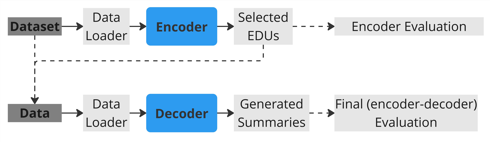

# GraphBasedSummarizer

  

  

## Table of Contents
1. [Pipeline Explanation](#pipeline-explanation)
2. [Notes](#notes)

  

## Pipeline Explanation

1. CNN/DM or XSum datasets are being used. In the encoder part, we need the following information for each document: graph informatin, EDUs, and oracle labels for EDUs.

2. The necessary informaiton will be transformed into pyTorch dataloader object.

3. We will train/fine-tune an Encoder to classify EDUs into important or peripheral (zero or one).

4. We calcualte Percision, Recall, and F1 score based on the predicted labels for EDUs and oracle labels.

5. We use the oracle summary for each document from the dataset and the contatenated selected EDUs as the data for the decoder part.

6. Similarly, we transform the data into dataloader.

7. A decoder will be fine-tuned to generate the final summaries.

8. By comparing the generated summary with the oracle summary, we calculate ROUGE scores.

  
